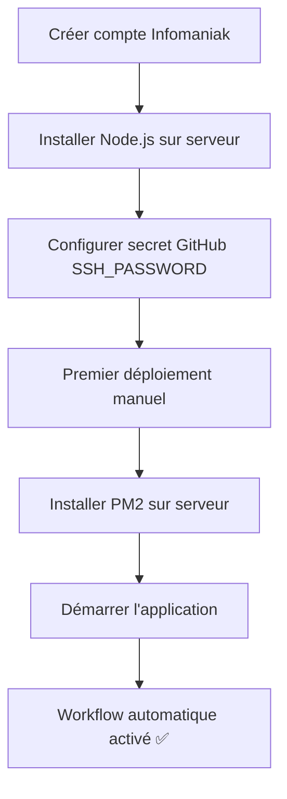
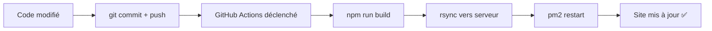

# 🚀 Guide de Déploiement - MineralTax sur Infomaniak

Guide complet pour déployer et maintenir MineralTax sur l'hébergement Infomaniak.

---

## ✨ Déploiement Automatique (Recommandé)

Le déploiement se fait **automatiquement via GitHub Actions** à chaque push sur la branche `main`.

### 🎯 Workflow automatique

**À chaque commit sur `main` :**

1. ✅ GitHub Actions détecte le push
2. ✅ Build le projet (`npm run build`)
3. ✅ Déploie le dossier `dist/` sur Infomaniak via rsync
4. ✅ Redémarre l'application avec PM2
5. ✅ Votre site est à jour automatiquement !

### 📋 Prérequis (configuration initiale)

**Une seule fois :** Configurez le secret GitHub si ce n'est pas déjà fait :

1. Allez sur : https://github.com/Ndjaka/MineralTax/settings/secrets/actions
2. Cliquez sur **"New repository secret"**
3. Nom : `SSH_PASSWORD`
4. Valeur : `Kombi1989*`
5. Cliquez sur **"Add secret"**

### 🔄 Utilisation quotidienne

```bash
# 1. Faites vos modifications en local
nano client/src/pages/subscription.tsx

# 2. Testez localement
npm run dev

# 3. Commitez et pushez
git add .
git commit -m "feat: amélioration de la page d'abonnement"
git push origin main

# 4. C'est tout ! Le déploiement est automatique
# Vérifiez sur : https://github.com/Ndjaka/MineralTax/actions
```

### 🎛️ Déclenchement manuel

Vous pouvez déclencher un déploiement manuellement sans faire de commit :

1. Allez sur : https://github.com/Ndjaka/MineralTax/actions
2. Cliquez sur **"Deploy to Infomaniak"**
3. Cliquez sur **"Run workflow"**
4. Sélectionnez la branche `main`
5. Cliquez sur **"Run workflow"**

---

## 🛠️ Déploiement Manuel (Si besoin)

En cas de problème avec GitHub Actions, vous pouvez déployer manuellement depuis votre Mac.

### 1. Build local

```bash
cd /Users/eugenendjaka/Downloads/MineralTax
npm install
npm run build
```

### 2. Déployer via rsync

```bash
# Définir le mot de passe SSH
export SSHPASS='Kombi1989*'

# Déployer le dossier dist/
sshpass -e rsync -avz --delete \
  -e "ssh -o StrictHostKeyChecking=no" \
  --exclude='node_modules' \
  --exclude='.git' \
  dist/ \
  N89UEvW6WcN_Mineraltax@57-106659.ssh.hosting-ik.com:sites/mineraltax.ch/dist/
```

### 3. Redémarrer l'application

```bash
# Via le script de monitoring
./monitor.sh status

# Ou directement via SSH
sshpass -e ssh -o StrictHostKeyChecking=no \
  N89UEvW6WcN_Mineraltax@57-106659.ssh.hosting-ik.com \
  'cd sites/mineraltax.ch && ./node_modules/.bin/pm2 restart mineraltax'
```

---

## 📦 Gestion de PM2 sur le serveur

### Connexion au serveur

```bash
ssh N89UEvW6WcN_Mineraltax@57-106659.ssh.hosting-ik.com
cd sites/mineraltax.ch
```

### Commandes PM2 courantes

```bash
# Voir le statut
./node_modules/.bin/pm2 status

# Redémarrer
./node_modules/.bin/pm2 restart mineraltax

# Arrêter
./node_modules/.bin/pm2 stop mineraltax

# Démarrer
./node_modules/.bin/pm2 start dist/index.mjs --name mineraltax

# Voir les logs
./node_modules/.bin/pm2 logs mineraltax

# Sauvegarder la configuration
./node_modules/.bin/pm2 save
```

---

## 🔍 Vérification du déploiement

### 1. Vérifier GitHub Actions

👉 https://github.com/Ndjaka/MineralTax/actions

- ✅ Toutes les étapes doivent être vertes
- ✅ Durée totale : ~2-3 minutes
- ❌ Si une étape échoue, cliquez dessus pour voir les logs

### 2. Vérifier l'application

```bash
# Via le script de monitoring
./monitor.sh status
./monitor.sh ping

# Vérifier que le site répond
curl -I https://mineraltax.ch
```

### 3. Tester en ligne

- 🌐 Site principal : https://mineraltax.ch
- 📊 Page d'abonnement : https://mineraltax.ch/subscription
- ⚙️ Paramètres : https://mineraltax.ch/settings

---

## 🚨 Résolution de problèmes

### Problème 1 : Le workflow GitHub Actions échoue

**Solution :**

1. Vérifiez les logs sur : https://github.com/Ndjaka/MineralTax/actions
2. Vérifiez que le secret `SSH_PASSWORD` existe
3. Si nécessaire, redéployez manuellement (voir section ci-dessus)

### Problème 2 : PM2 n'est pas installé

**Solution :**

```bash
ssh N89UEvW6WcN_Mineraltax@57-106659.ssh.hosting-ik.com
cd sites/mineraltax.ch
npm install pm2
./node_modules/.bin/pm2 start dist/index.mjs --name mineraltax
./node_modules/.bin/pm2 save
```

### Problème 3 : L'application ne démarre pas

**Solution :**

```bash
# 1. Vérifier les logs
ssh N89UEvW6WcN_Mineraltax@57-106659.ssh.hosting-ik.com
cd sites/mineraltax.ch
./node_modules/.bin/pm2 logs mineraltax --lines 50

# 2. Vérifier les variables d'environnement
cat .env

# 3. Redémarrer
./node_modules/.bin/pm2 restart mineraltax
```

### Problème 4 : Site inaccessible (502/503)

**Solution :**

```bash
# 1. Vérifier que PM2 tourne
./monitor.sh status

# 2. Vérifier les ports
ssh N89UEvW6WcN_Mineraltax@57-106659.ssh.hosting-ik.com
lsof -i :3000

# 3. Redémarrer si nécessaire
cd sites/mineraltax.ch
./node_modules/.bin/pm2 restart mineraltax
```

---

## 📁 Structure des fichiers sur le serveur

```
/srv/customer/sites/mineraltax.ch/
├── dist/                       # ✅ Application compilée (déployée auto)
│   ├── index.mjs              # Serveur Node.js
│   └── public/                # Assets statiques
├── node_modules/              # Dépendances Node.js
│   └── .bin/pm2              # PM2
├── .env                       # Variables d'environnement
├── mineraltax.db             # Base de données SQLite
├── package.json              # Configuration npm
└── package-lock.json         # Lockfile npm

/srv/customer/.pm2/
├── logs/                      # Logs PM2
│   ├── mineraltax-out.log    # Logs de sortie
│   └── mineraltax-error.log  # Logs d'erreur
└── dump.pm2                  # Configuration PM2 sauvegardée
```

---

## 🔄 Workflow de déploiement complet

### Configuration initiale (une seule fois)



### Déploiement quotidien (automatique)



---

## 🔐 Sécurité

### Variables d'environnement

Le fichier `.env` **n'est jamais déployé** automatiquement (exclu dans le workflow).

Pour modifier les variables d'environnement en production :

```bash
ssh N89UEvW6WcN_Mineraltax@57-106659.ssh.hosting-ik.com
cd sites/mineraltax.ch
nano .env
# Modifier les variables
# Sauvegarder (Ctrl+O, Enter, Ctrl+X)

# Redémarrer l'application
./node_modules/.bin/pm2 restart mineraltax
```

### Secrets GitHub

**Ne jamais commiter** :
- Mots de passe
- Clés API (Stripe, Resend, etc.)
- Tokens d'authentification

Utilisez **GitHub Secrets** à la place.

---

## 📊 Monitoring

Pour surveiller votre application en production, consultez **MONITORING.md**.

**Commandes rapides :**

```bash
# Statut de l'application
./monitor.sh status

# Logs en temps réel
./monitor.sh logs

# Test de disponibilité
./monitor.sh ping
```

---

## 🆘 Support

### Si vous avez besoin d'aide

1. **Consultez les logs** :
   ```bash
   ./monitor.sh logs
   ```

2. **Vérifiez GitHub Actions** :
   https://github.com/Ndjaka/MineralTax/actions

3. **Redéployez manuellement** :
   Suivez la section "Déploiement Manuel" ci-dessus

4. **Contactez le support Infomaniak** :
   https://www.infomaniak.com/fr/support

---

## 📝 Checklist de déploiement

### Avant chaque déploiement important

- [ ] Tests locaux passent (`npm run dev`)
- [ ] Build local réussi (`npm run build`)
- [ ] Variables `.env` à jour sur le serveur
- [ ] Backup de la base de données (si modif du schéma)
- [ ] Communication aux utilisateurs (si maintenance prévue)

### Après chaque déploiement

- [ ] Workflow GitHub Actions ✅
- [ ] Application `online` dans PM2
- [ ] Site accessible : https://mineraltax.ch
- [ ] Pas d'erreurs dans les logs
- [ ] Fonctionnalités testées manuellement

---

## 🔗 Liens utiles

- **GitHub Repository** : https://github.com/Ndjaka/MineralTax
- **GitHub Actions** : https://github.com/Ndjaka/MineralTax/actions
- **Site en production** : https://mineraltax.ch
- **Manager Infomaniak** : https://manager.infomaniak.com/
- **Support Infomaniak** : https://www.infomaniak.com/fr/support

---

**Dernière mise à jour** : 22 janvier 2026  
**Version** : Déploiement automatique avec GitHub Actions + PM2
